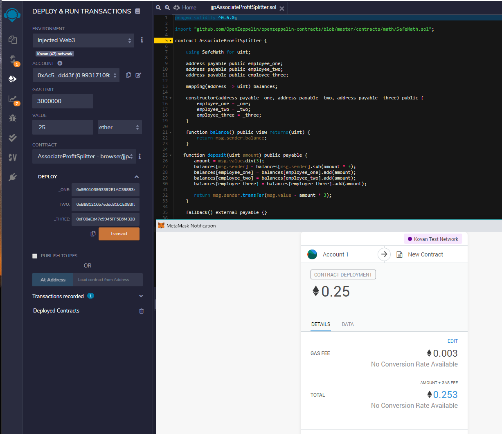

## Test network: Kovan
## Motivation:  
This contract splits payment of employees equally and pays them in Ethereum.  This provides a secure and fast transaction without a burdensome payroll and banking process.
## Procedures:
1. Open Kovan Test Network in Metamask
1. Open jjpAssociateProfitSplitter.sol in Remix and Compile
1. Enter Value - Total amount of Ethereum to pay that will be split between 3 employees
1. Enter employess addresses
1. Deploy Contract
## Screenshot:

## Contract Address:  0xf7a93F05364F26DBD5123290877C69E179e13059
